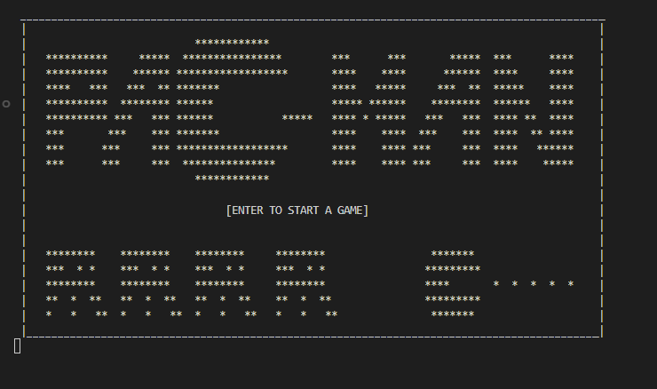

# Pacman: The Escape 2021
🕹️ A Pacman inspired console game built in C++. The game is built in requirement for the course Data Structures and Algorithm during the first year. The game aims to showcase the used algorithm, Greedy algorithm which can be seen in the enemy's movements. 

🗒️Note: The game is not fully completed and made as an MVP (Minimum Viable Product) for the course.

## Installation
1. Clone the repository
2. You can either run the game in an IDE or run the executable file with in the `output` folder.

## Preview 

`@` - The enemy
`<` - The player
`#` - The wall
`0` - The coin 

The game contains a total of 3 maps each with new challenges and interactions. The can be controlled with the use of arrow keys. 

